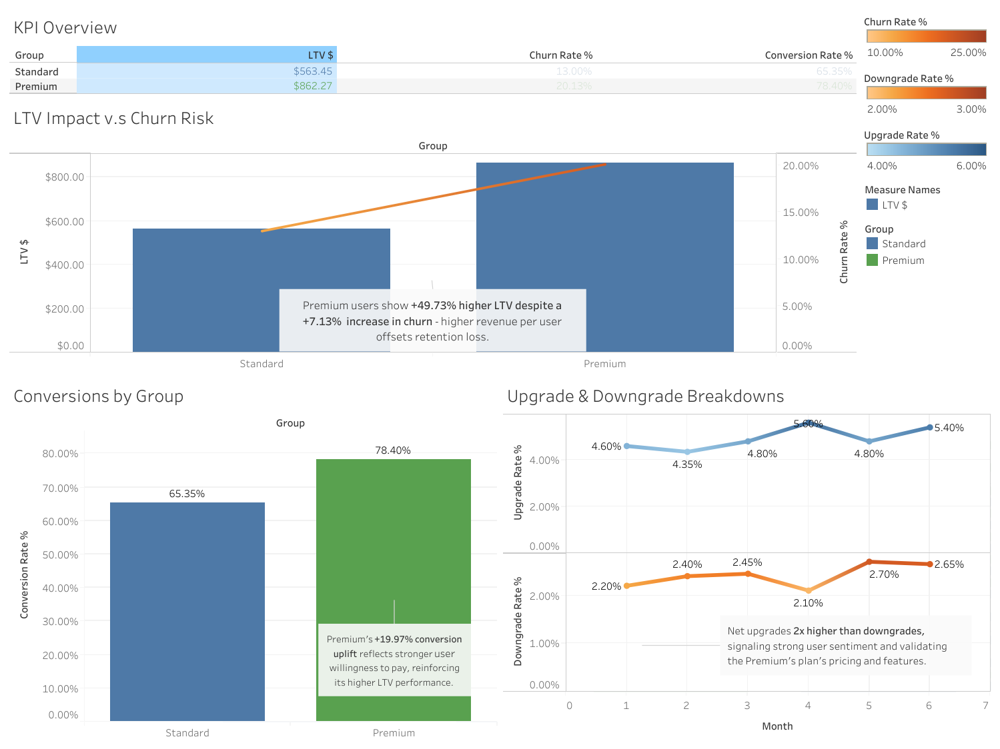

# 📊 Netflix Pricing Tier LTV Experiment  
**Merged Test of Feature & Price Impact**

This case study simulates a pricing tier experiment for a subscription-based product like Netflix. It explores how a newly introduced Premium plan—with a higher price and enhanced features—impacts customer Lifetime Value (LTV), churn, and user upgrade behavior compared to the existing Standard plan.

🔗 [View the Interactive Tableau Dashboard](https://public.tableau.com/views/NetflixPricingTierLTVExperimentMergedTestofFeaturePriceImpact/Dashboard1?:language=en-US&:sid=&:redirect=auth&:display_count=n&:origin=viz_share_link)

## 📊 Dashboard Preview

---

## 📊 Problem Statement

Netflix's product team is exploring two monetization paths:

- **Standard Tier**: $17.99/month — no new features
- **Premium Tier**: $29.99/month — includes a new built-in feature that enables seamless streaming even with poor internet

The Premium tier price was recently increased from **$25.99** to **$29.99**.

---

## 📊 Business Question

> Does introducing a Premium tier with a new feature at a higher price ($29.99) generate higher long-term revenue (LTV) than maintaining a Standard-only plan at $17.99, while keeping churn at an acceptable level?

---

## 📊 Hypotheses

### 1. 📈 **Primary Hypothesis – LTV Impact**

- **H₀**: No significant difference in average LTV between Premium and Standard tiers.
- **H₁**: Premium tier is at least 15% higher average projected LTV compared to the Standard tier.

### 2. 📈 **Secondary Hypothesis – Churn Risk**

- **H₀**: Churn rate remains the same or lower for the Premium tier.
- **H₁**: Churn rate for the Premium tier is at least 1.5x higher in Premium, potentially offsetting revenue gains by 5-10%.

### 3. 📈 **Behavioral Hypothesis – User Response**

- **H₀**: The premium tier does not lead to significantly improved user behavior. LTV increase, if any, is not statistically significant.
- **H₁**: Premium tier boosts LTV by at least 10%, driven by:
          ≥ 10% increase in conversion rate
          ≥ 15% decrease in downgrade rate
  	
---

## 📊 Experiment Design

- **Type**: Simulated SaaS Pricing Tier A/B Test (Merged: Feature + Price)
- **Groups**:
  - `Standard`: $17.99/month, no new feature
  - `Premium`: $29.99/month, includes new feature
- **Sample Size**: 1,000 users per group
- **Duration**: 6 months (simulated)
- **Controlled Variables**: Acquisition channels, onboarding, UX

---

## 📊 Notes

This test assumes:
- Phase 1: Price sensitivity was validated between $25.99 and $29.99.
- Phase 2: Feature acceptance was validated at $25.99.
- Phase 3 (this case): Merged test for full rollout feasibility.

---

## 📊 Key Metrics Tracked

| Metric                  | Description                                      |
|------------------------|--------------------------------------------------|
| **Conversion Rate**    | % of users who convert from trial or free        |
| **Churn Rate**         | % of users who cancel subscription               |
| **Retention Rate**     | % of users who remain active over time           |
| **LTV**                | Lifetime Value = ARPU × 6 (months)               |
| **ARPU**               | Average Revenue Per User                         |
| **Upgrade Rate**       | % of users who move from Standard → Premium      |
| **Downgrade Rate**     | % of users who move from Premium → Standard      |

---

## 📁 Simulated Dataset

>  [Click here to view dataset.csv](netflix_pricing_ltv_experiment.csv)

| user_id | group     | month | converted | churned | active | upgraded | downgraded | monthly_revenue | 
|---------|-----------|-------|-----------|---------|--------|----------|------------|---------|
| 001     | Premium   | 1     | 1         | 0       | 1      | 0        | 0          | 29.99   | 
| ...     | ...       | ...   | ...       | ...     | ...    | ...      | ...        | ...     | 

---

## 📊 Key Insights

### 📈 LTV vs. Churn Risk

- Premium users have **~50% higher projected LTV** than Standard users.
- Churn risk increases **moderately** in Premium, but not enough to offset the revenue benefit.

### 📈 Conversion Rate Impact

- Premium tier shows a **+19.97% increase** in conversion rate over Standard.
- Indicates stronger perceived value from pricing + feature combo.

### 📈 Upgrade & Downgrade Behavior

- Upgrade rate is nearly **2×** higher than downgrade rate across 6 months.
- Signifies strong acceptance of Premium pricing and product improvements.

---

### 📈 Tools Used
- Tableau for visualization & dashboarding

- Excel / Google Sheets for simulation & data prep

- Markdown & GitHub for documentation

---

## 📌 Case Author

**Samantha Yoong**  
*Aspiring product & growth analyst focused on clean tech, user psychology, and systems thinking.*  
📬 [LinkedIn](https://www.linkedin.com/in/samantha-yoong-8551b4226/) | [Portfolio](https://samanthayoong.github.io/)
  
---

### ⭐ What You’ll Learn from This Case

- How to structure A/B pricing tests for SaaS

- When to use LTV, churn, and behavioural insights

- How to simulate data for analytics portfolios

- Effective dashboard layout for hiring visibility

---
